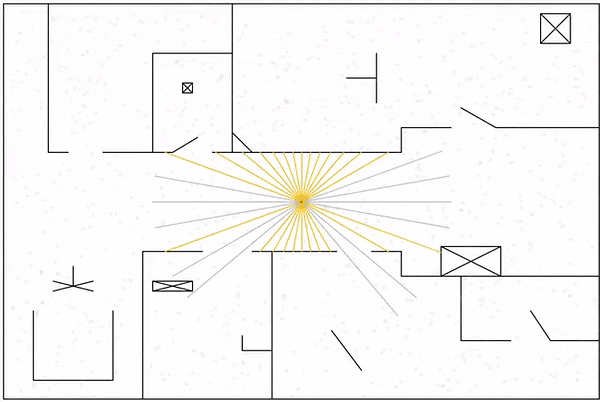
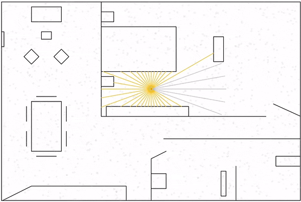

# AI---Particle-Filter
JavaScript/p5.js implementation of a Particle Filter algorithm.
Together with Importance Sampling, Particle Filter algorithms can be used to predict the localisation of a robot in a room based on its noisy sensors' data.

## Demo
Here are two examples obtained with this p5.js implementation:

_Legends:_
- _the yellow dot represents the robot_
- _the grey dots represent the particles or the predictions made by the algorithm_
- _the green dot represents the best prediction_
